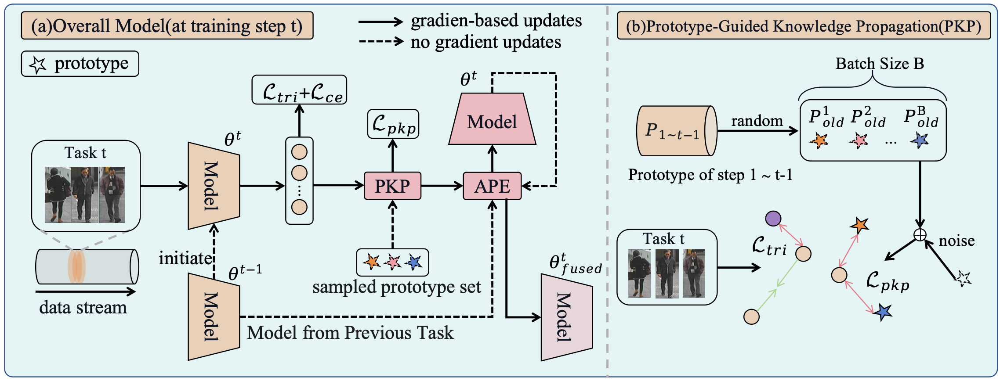
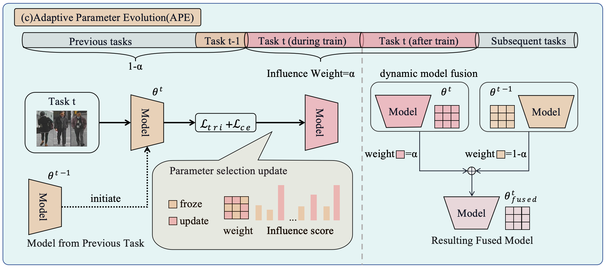

# IJCAI 2025 - PKA

This repository contains the official implementation of the paper:

## Prototype-guided Knowledge Propagation with Adaptive Learning for Lifelong Person Re-identification  
Zhijie Lu, Wuxuan Shi, He Li, Mang Ye

[[Paper]](./ijcai2025.pdf)

  


---

## 🔍 Introduction
Lifelong Person Re-identification (LReID) aims to continually adapt to new environments while preserving previously acquired knowledge.  
However, most existing methods rely on storing exemplar data, which raises **privacy concerns**.  
To address this, we propose **PKA**, a **non-exemplar-based framework** with two key components:

- **Prototype-guided Knowledge Propagation (PKP):**  
  Utilizes prototypes with triplet constraints to separate old and new identity distributions, mitigating catastrophic forgetting.  

- **Adaptive Parameter Evolution (APE):**  
  Dynamically fuses model parameters across tasks by assessing parameter importance, ensuring effective integration of old and new knowledge.

PKA achieves **state-of-the-art performance** on five benchmark datasets (Market1501, CUHK-SYSU, DukeMTMC, MSMT17, CUHK03), outperforming existing prototype-based methods in both **seen** and **unseen domains**.

---

## 📂 Datasets
We follow the standard LReID benchmark setup and evaluate on:
- Market-1501
- CUHK-SYSU
- DukeMTMC-ReID
- MSMT17-V2
- CUHK03  

For generalization, additional unseen datasets (CUHK01, CUHK02, VIPeR, PRID, i-LIDS, GRID, SenseReID) are also tested.

---

## 🧪 Experimental Configuration
Our experiments are configured using the following command-line arguments.

### Data & Model Settings
- `--batch-size`: `128` - Training batch size.
- `--workers`: `8` - Number of data loading workers.
- `--height`: `256` - Input image height.
- `--width`: `128` - Input image width.
- `--num-instances`: `4` - Number of instances per identity in a batch.
- `--MODEL`: `'50x'` - The model architecture to use.

### Optimizer & Training Settings
- `--optimizer`: `'SGD'` - Optimizer to use (`SGD` or `Adam`).
- `--lr`: `0.008` - Learning rate.
- `--momentum`: `0.9` - Momentum for the SGD optimizer.
- `--weight-decay`: `1e-4` - Weight decay.
- `--warmup-step`: `10` - Number of warmup steps for the learning rate.
- `--milestones`: `[30]` - Epochs at which to decay the learning rate.
- `--epochs0`: `80` - Number of epochs for the first task.
- `--epochs`: `60` - Number of epochs for subsequent tasks.
- `--seed`: `1` - Random seed for reproducibility.
- `--setting`: `1` - Training order setting (`1` or `2`).
- `--device`: `'cuda'` - Training device (`cuda` or `cpu`).

### PKA Method Hyperparameters
- `--AF_weight`: `0.1` - Weight for the anti-forgetting loss.
- `--n_sampling`: `6` - Number of samples from the Gaussian distribution.
- `--lambda_1`: `0.1` - Temperature parameter 1.
- `--lambda_2`: `0.1` - Temperature parameter 2.
- `--score_batch_percentage`: `0.25` - Percentage of the batch used for scoring.

---

## ✨ Citation
If you find this work useful, please cite:

```bibtex
@article{luprototype,
  title={Prototype-guided Knowledge Propagation with Adaptive Learning for Lifelong Person Re-identification},
  author={Lu, Zhijie and Shi, Wuxuan and Li, He and Ye, Mang}
}
